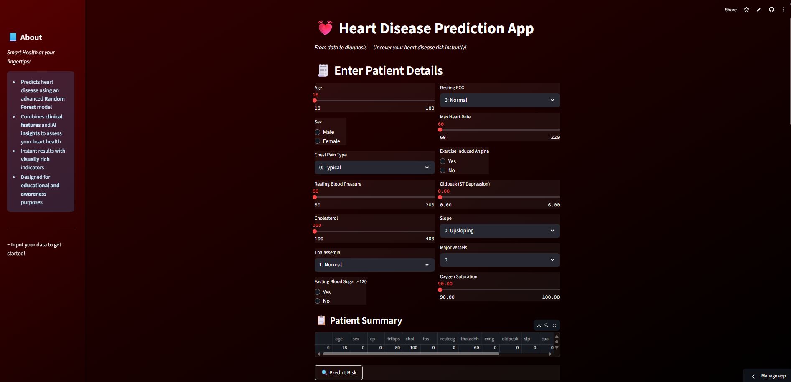
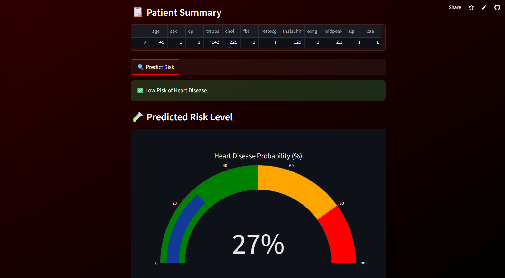
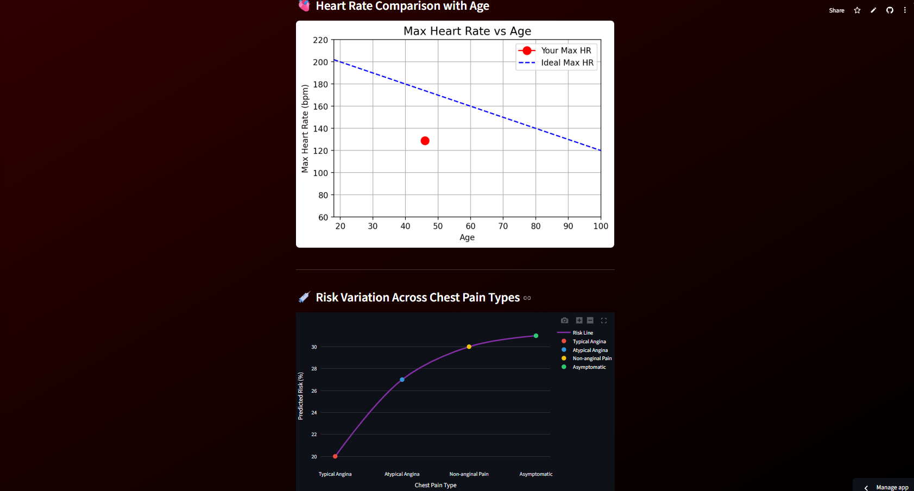

# 💓 Heart Disease Prediction App

A powerful, AI-powered Streamlit application designed to predict the risk of heart disease based on patient data. Built with machine learning and medical data insights, the app provides real-time visual feedback and interactive health analytics.

---

## 🚀 Features

- 🎯 **Accurate Predictions** – Uses a trained **Random Forest** classifier on medical features.
- 📊 **Interactive Visualizations** – Dynamic charts (gauge, bar, line) to visualize patient metrics.
- 🧠 **Feature Importance Graph** – Displays model’s understanding of most relevant features.
- 🧾 **Two-Column Input UI** – Responsive layout for collecting patient health details.
- 📌 **Patient Summary View** – Review input data before generating predictions.

---

## 👁️ Preview

### > Form Page


### > Risk Gauge Chart


### > Metric Visualizations


---

## 🛠️ Tech Stack

- **Frontend:** Streamlit, HTML/CSS (Custom Styling)
- **ML Model:** Random Forest Classifier (Trained on public heart disease dataset)
- **Visualization:** Plotly, Matplotlib
- **Backend:** Python, Pandas, NumPy, Joblib (for model persistence)

---

## 🧪 Model Details

- **Algorithm Used:** Random Forest Classifier
- **Preprocessing Done:** Null handling, Label Encoding, Scaling
- **Frameworks:** Scikit-learn, Pandas, NumPy

---

## 🔧 Getting Started

### 1. Clone the Repository

```bash
git clone https://github.com/your-username/HeartDiseasePredictor.git
cd HeartDiseasePredictor
```

### 2. Setup the Environment

Install all required libraries using pip:

```bash
pip install -r requirements.txt
```

Make sure to include a `requirements.txt` like this:

```txt
streamlit
pandas
numpy
scikit-learn
joblib
matplotlib
plotly
```

### 3. Run the App

```bash
streamlit run app.py
```
---

## 📌 Notes

- This app is for educational and awareness purposes only.
- Model predictions should not be used as medical diagnosis.
- Tailor the model and preprocessing to your own dataset for production use.

---

## 🌐 Live Demo

Check out the Live App : 

---
